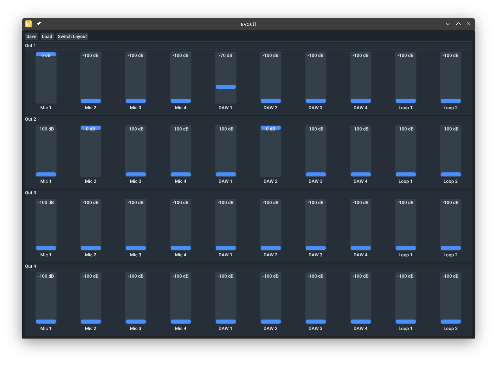
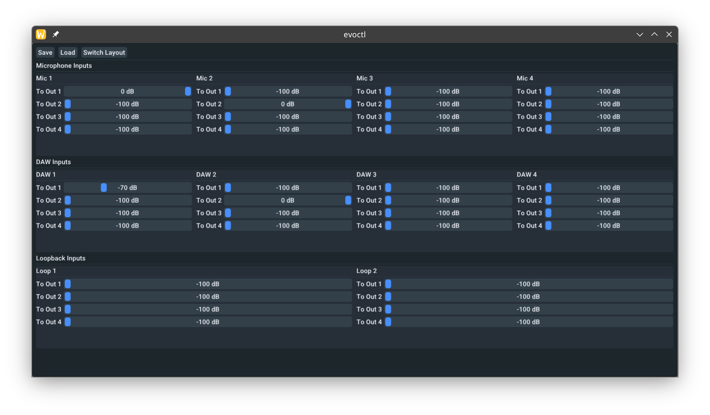

# evoctl-ng - A modern graphical control panel for Audient EVO audio interfaces

A fork of the original [evoctl project by soerenbnoergaard](https://github.com/soerenbnoergaard/evoctl), completely rewritten to provide a modern, feature-rich GUI for Audient EVO 4 and EVO 8 audio interfaces on Linux.

It provides a simple and intuitive interface to control all volumes, save and load presets, and switch between different mixer layouts.

*Note: This application uses `libusb` to communicate directly with the hardware. This means it cannot run at the same time as a DAW or any other application that needs to access the EVO audio interface. You must run `evoctl` **before** starting your DAW to configure your mix, and then close it.*

### Output-Based Layout


### Input-Based Layout


## Features

- **Full Mixer Control**: Graphical control of all input and output channel volumes.
- **Save & Load Presets**: Save your favorite mixer settings to a JSON file and load them back at any time. Presets are stored in `~/.config/evoctl/settings.json`.
- **Dual Layout Modes**: 
  - **Output-Based**: A traditional mixer view with one column per output channel (e.g., Main, Headphone), showing all input faders for that output.
  - **Input-Based**: A view organized by input source (e.g., Mic 1, DAW 1/2), showing the faders for each output that the source is routed to.
- **Modern UI**: A clean, dark-themed UI.
- **Responsive Design**: The layout dynamically adjusts to the window size.
- **Automatic Device Detection**: Works with both EVO 4 and EVO 8.

## Installation

### 1. Dependencies

First, you need to install a few system libraries.

**For Debian/Ubuntu:**
```bash
sudo apt-get update
sudo apt-get install build-essential pkg-config libusb-1.0-0-dev libglfw3-dev libglew-dev
```

**For Arch Linux:**
```bash
sudo pacman -Syu base-devel pkg-config libusb libglfw-x11
```

**For Fedora:**
```bash
sudo dnf groupinstall "Development Tools"
sudo dnf install pkg-config libusb1-devel glfw-devel glew-devel
```

### 2. Build

1.  **Clone the repository:**
    ```bash
    git clone https://github.com/felipegaspari/evoctl.git
    cd evoctl
    ```

2.  **Initialize Submodules:**
    This project uses submodules for Dear ImGui, GLFW, GLEW, and nlohmann/json.
    ```bash
    git submodule update --init --recursive
    ```
    *Note: If you cloned the repository with `git clone --recurse-submodules ...`, you can skip this step.*

3.  **Compile the application:**
    Simply run `make` from the project's root directory.
    ```bash
    make
    ```
    This will compile the project and create an executable named `evoctl` in the `evoctl` directory.

## How to Run

After building, you can run the application from the project root to open the graphical interface:
```bash
./evoctl
```

### Command-Line Usage (Headless)

You can also load your saved settings without opening the GUI. This is useful for automatically applying your preferred mixer configuration when you start your system.

```bash
./evoctl --load-settings
```
This command will find your saved `settings.json`, apply all the volumes to the device, and then exit.

#### Autostart on Linux (GNOME, KDE, etc.)

You can use this command to automatically configure your EVO interface every time you log in.

1.  **Open your Startup Applications tool.**
    - In GNOME, search for "Startup Applications".
    - In KDE, look for "Autostart" in the System Settings.
    - Other desktop environments have similar tools.

2.  **Add a new startup program.**
    - **Name**: `EVO Settings Loader`
    - **Command**: `/path/to/your/evoctl/repo/evoctl --load-settings` (Make sure to use the **full path** to the executable).
    - **Comment**: `Loads Audient EVO mixer settings.`

Now, your preferred mixer settings will be applied automatically every time your desktop session starts.

### udev Rules (for non-root access)

To run `evoctl` without needing `sudo`, you must grant your user permission to access the Audient EVO device. You can do this by creating a `udev` rule.

1.  Create a new rule file:
    ```bash
    sudo nano /etc/udev/rules.d/55-audient-evo.rules
    ```

2.  Add the following lines to the file:
    ```
    SUBSYSTEM=="usb", ATTR{idVendor}=="2708", ATTR{idProduct}=="0006", MODE="0666"
    SUBSYSTEM=="usb", ATTR{idVendor}=="2708", ATTR{idProduct}=="0007", MODE="0666"
    ```

3.  Reload the udev rules for the changes to take effect:
    ```bash
    sudo udevadm control --reload-rules && sudo udevadm trigger
    ```
    You may need to unplug and reconnect your device for the new rule to apply.

## Credits & Acknowledgements

- **Original Project**: This work is heavily based on the original [evoctl by soerenbnoergaard](https://github.com/soerenbnoergaard/evoctl). Thank you for the reverse-engineering work and solid foundation.
- **Dear ImGui**: For the graphical user interface. ([ocornut/imgui](https://github.com/ocornut/imgui))
- **GLFW**: For window and input handling. ([glfw/glfw](https://github.com/glfw/glfw))
- **GLEW**: The OpenGL Extension Wrangler Library. ([nigels-com/glew](https://github.com/nigels-com/glew))
- **nlohmann/json**: For JSON preset serialization. ([nlohmann/json](https://github.com/nlohmann/json))
